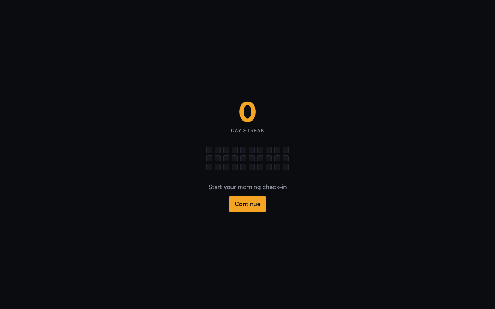
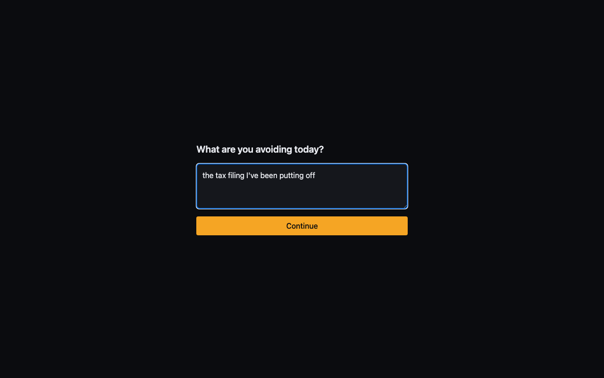
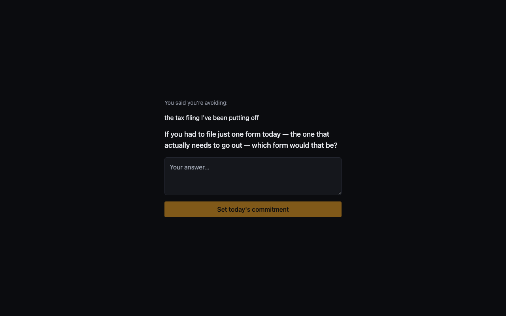
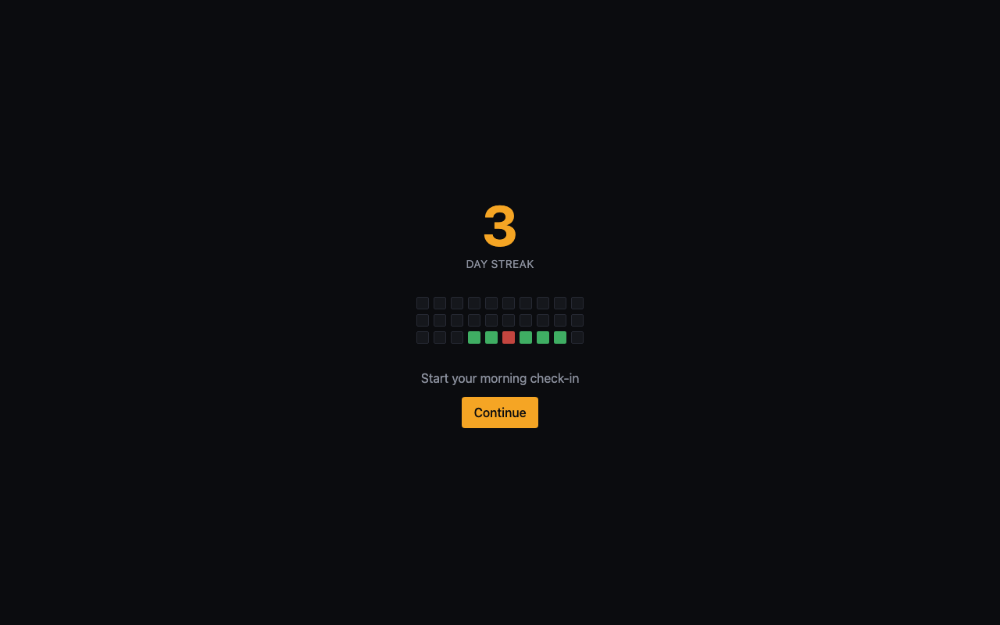
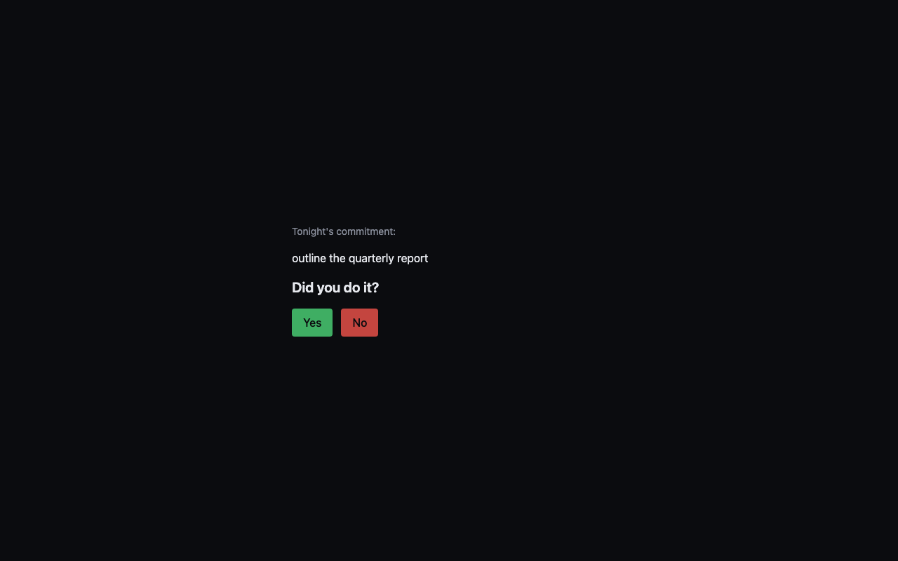
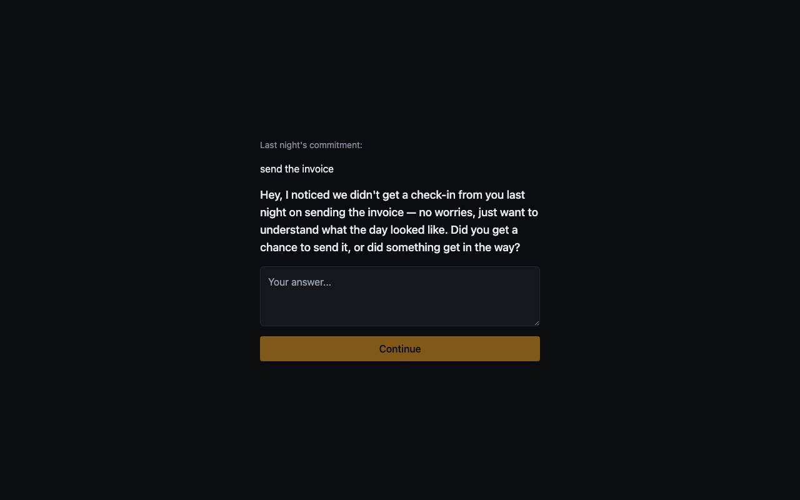

# Dailyman

A quiet, daily accountability loop: every morning you name what you're avoiding, an AI
partner asks one sharpening question to shrink it into something startable, and every
night you report back. No badges, no confetti — just a streak, a 30-day heatmap, and a
running record of what actually happened.

## How it works

**Morning** — you say what you're avoiding today. The app asks one live, reactive
follow-up question meant to narrow it into something you could start in the next 30
minutes. Your answer becomes today's commitment.

**Night** — you report whether you did it.
- **Yes** → "What did you learn?" (closes the loop, banks the streak)
- **No** → "What blocked you?" (no shame, just data)

**Missed a night?** The next morning, before a new commitment prompt appears, the app
asks what happened — the gap becomes a recorded data point instead of a silent reset.

A single missed check-in of either kind resets the streak to zero. No grace period.

## Screenshots

| | |
|---|---|
|  |  |
| Main screen — streak, 30-day heatmap, and today's entry point | Morning check-in — the opening question |
|  |  |
| A live, reactive follow-up shrinks the task into something startable | Streak and heatmap after a few days — green for complete, red for incomplete |
|  |  |
| Night check-in — did you do it? | Missed a check-in? Acknowledged before the new day starts, not silently skipped |

## Stack

React + Vite + TypeScript, Tailwind CSS (dark theme, single accent color), IndexedDB
(via `idb`) for local persistence, and two direct client-side calls to the Anthropic
Messages API for the only two points that need genuine reactivity: the morning
follow-up question and the missed-check-in acknowledgment. Everything else — streak
math, heatmap rendering, state transitions — is deterministic local logic.

No backend, no database, no accounts. This is a local-first, single-user app: your
data and your API key live only in your browser's IndexedDB.

## Getting started

```bash
npm install
npm run dev
```

Open the printed local URL. On your first check-in, you'll be asked for an Anthropic
API key — it's stored locally on your device and never sent anywhere except directly
to Anthropic's API.

> **Note**: because the app calls the Anthropic API directly from the browser, your
> API key is readable by anyone with access to your device. That's an acceptable
> trade-off for a personal, single-user tool, but this app should not be deployed
> publicly or used by multiple people without adding a server-side proxy first.

## Scripts

```bash
npm run dev       # start the dev server
npm run build     # type-check and build a production bundle
npm run test      # run the test suite (Vitest + React Testing Library)
npm run lint      # lint the whole project
```

## Project structure

```text
src/
├── components/   # MainScreen, MorningCheckin, NightCheckin, AcknowledgmentStep, ...
├── state/        # the check-in state machine (useCheckinFlow) and pure phase logic
├── storage/      # IndexedDB wrapper and CRUD for daily entries / settings
├── ai/           # the Anthropic client and the two live-generation calls
└── lib/          # streak computation, heatmap projection, date utilities

tests/
├── unit/         # streak, heatmap, state machine, storage, missed-check-in logic
└── components/   # component-level tests for each check-in screen
```

This project was built with [GitHub Spec Kit](https://github.com/github/spec-kit) —
the full spec, implementation plan, data model, and task breakdown live under
[`specs/001-dailyman-app/`](specs/001-dailyman-app/).
